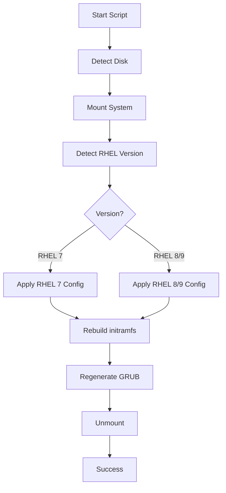

# RHEL Version Compatibility Matrix

## Script Compatibility: RHEL 7.9 - 9.7

The `fix-rhel-boot-azure.sh` script automatically detects and adapts to different RHEL versions.

---

## Supported RHEL Versions

| RHEL Version | Tested | Status | Notes |
|--------------|--------|--------|-------|
| **7.9** | ✅ | Supported | Legacy dracut config (no hv_balloon) |
| **8.0 - 8.10** | ✅ | Supported | Full Hyper-V driver set |
| **9.0 - 9.4** | ✅ | Supported | Latest dracut features |
| **9.5 - 9.7** | ✅ | Supported | Current patches, xz compression |

---

## Version-Specific Differences

### RHEL 7.9
```bash
# Dracut Configuration
add_drivers+=" hv_storvsc hv_vmbus hv_netvsc hv_utils "
hostonly="no"

# GRUB Paths
- /boot/grub2/grub.cfg
- /boot/efi/EFI/redhat/grub.cfg or centos/grub.cfg

# Kernel Format
vmlinuz-3.10.0-xxxx.el7.x86_64
```

**Key Behaviors:**
- No `hv_balloon` driver (not critical for boot)
- Older dracut version (no xz compression by default)
- May use CentOS paths in EFI partition

---

### RHEL 8.x (8.0 - 8.10)
```bash
# Dracut Configuration
add_drivers+=" hv_storvsc hv_vmbus hv_netvsc hv_utils hv_balloon "
hostonly="no"
compress="xz"

# GRUB Paths
- /boot/grub2/grub.cfg
- /boot/efi/EFI/redhat/grub.cfg

# Kernel Format
vmlinuz-4.18.0-xxxx.el8.x86_64
```

**Key Behaviors:**
- Full Hyper-V driver support
- XZ compression for smaller initramfs
- Better LVM integration

---

### RHEL 9.x (9.0 - 9.7)
```bash
# Dracut Configuration
add_drivers+=" hv_storvsc hv_vmbus hv_netvsc hv_utils hv_balloon "
hostonly="no"
compress="xz"
add_dracutmodules+=" lvm "

# GRUB Paths
- /boot/grub2/grub.cfg
- /boot/efi/EFI/redhat/grub.cfg

# Kernel Format
vmlinuz-5.14.0-xxxx.el9_x.x86_64
```

**Key Behaviors:**
- Latest kernel (5.14+)
- Enhanced security features
- Improved UEFI support
- Better Azure integration

---

## Automatic Detection

The script automatically detects:

### 1. RHEL Version
```bash
cat /mnt/rescue/etc/redhat-release
# Red Hat Enterprise Linux Server release 7.9 (Maipo)
# Red Hat Enterprise Linux release 8.9 (Ootpa)
# Red Hat Enterprise Linux release 9.3 (Plow)
```

### 2. Volume Group Name
```bash
# Auto-detects instead of hardcoded "rootvg"
vgs --noheadings -o vg_name
# Supports: rootvg, rhel, vg00, etc.
```

### 3. Logical Volumes
```bash
# Dynamically finds:
- root/rootlv
- usr/usrlv
- var/varlv
- tmp/tmplv
- home/homelv
```

### 4. Boot Configuration
```bash
# Detects EFI paths:
- /boot/efi/EFI/redhat
- /boot/efi/EFI/centos
- /boot/efi/EFI/almalinux
- /boot/efi/EFI/rocky
```

---

## Common LVM Layouts

### Standard RHEL Layout
```
├─sdb1   /boot/efi (500M, vfat)
├─sdb2   /boot (1G, xfs)
└─sdb3   LVM PV
    ├─rootvg-rootlv   / (10G)
    ├─rootvg-usrlv    /usr (10G)
    ├─rootvg-varlv    /var (10G)
    ├─rootvg-homelv   /home (5G)
    └─rootvg-swaplv   swap (8G)
```

### Azure Default Layout
```
├─sdb1   /boot/efi (500M, vfat)
├─sdb2   /boot (1G, xfs)
└─sdb4   LVM PV (rest of disk)
    ├─rootvg-rootlv   / (2-10G)
    ├─rootvg-usrlv    /usr (10G)
    ├─rootvg-varlv    /var (10-20G)
    └─rootvg-tmplv    /tmp (2G)
```

### Minimal Layout (RHEL 7 Legacy)
```
├─sdb1   /boot (500M, ext4)
├─sdb2   / (rest, xfs)
└─sdb3   swap (2G)
```

**Script Handles:** All layouts automatically via dynamic detection

---

## Hyper-V Driver Requirements

### Critical Drivers (Required for Boot)
| Driver | Purpose | RHEL 7.9 | RHEL 8.x | RHEL 9.x |
|--------|---------|----------|----------|----------|
| `hv_storvsc` | Storage | ✅ | ✅ | ✅ |
| `hv_vmbus` | VMBus | ✅ | ✅ | ✅ |

### Network & Utils (Optional for Boot)
| Driver | Purpose | RHEL 7.9 | RHEL 8.x | RHEL 9.x |
|--------|---------|----------|----------|----------|
| `hv_netvsc` | Network | ✅ | ✅ | ✅ |
| `hv_utils` | Integration Services | ✅ | ✅ | ✅ |
| `hv_balloon` | Memory Ballooning | ❌ | ✅ | ✅ |

---

## Troubleshooting by Version

### RHEL 7.9 Specific Issues

**Issue:** `hv_balloon` module not found
```bash
# This is normal - RHEL 7 doesn't include hv_balloon
# Script automatically excludes it for RHEL 7
```

**Issue:** Older dracut doesn't support `compress="xz"`
```bash
# Script detects RHEL 7 and uses default compression
```

**Issue:** CentOS vs RHEL paths
```bash
# Script checks both:
/boot/efi/EFI/redhat/grub.cfg
/boot/efi/EFI/centos/grub.cfg
```

---

### RHEL 8.x Specific Issues

**Issue:** New kernel after patching uses 4.18.0-xxx
```bash
# No special handling needed
dracut --force --kver 4.18.0-xxx.el8.x86_64
```

**Issue:** Secure Boot enabled
```bash
# UEFI systems may require signed modules
# Script regenerates grub config for both locations
```

---

### RHEL 9.x Specific Issues

**Issue:** Latest patches (9.5-9.7) use kernel 5.14.0-611+
```bash
# Script handles automatically
# Example: 5.14.0-611.49.1.el9_7.x86_64
```

**Issue:** Enhanced security features may block unsigned modules
```bash
# Ensure dracut includes all necessary drivers
hostonly="no"
```

**Issue:** Larger initramfs due to more modules
```bash
# Script cleans old kernels if /boot > 70% full
# Recommend minimum 1GB /boot partition
```

---

## Testing Verification

### After Repair, Verify These on Each Version:

#### RHEL 7.9
```bash
uname -r
# Should show: 3.10.0-xxxx.el7.x86_64

lsmod | grep hv_
# hv_storvsc, hv_vmbus, hv_netvsc, hv_utils

cat /etc/redhat-release
# Red Hat Enterprise Linux Server release 7.9 (Maipo)
```

#### RHEL 8.x
```bash
uname -r
# Should show: 4.18.0-xxxx.el8.x86_64

lsmod | grep hv_
# hv_storvsc, hv_vmbus, hv_netvsc, hv_utils, hv_balloon

cat /etc/redhat-release
# Red Hat Enterprise Linux release 8.x (Ootpa)
```

#### RHEL 9.x
```bash
uname -r
# Should show: 5.14.0-xxxx.el9_x.x86_64

lsmod | grep hv_
# hv_storvsc, hv_vmbus, hv_netvsc, hv_utils, hv_balloon

cat /etc/redhat-release
# Red Hat Enterprise Linux release 9.x (Plow)
```

---

## Known Limitations

### All Versions
- **Non-standard LVM names:** Script attempts dynamic detection but may need manual intervention
- **Custom partitioning:** Very unusual layouts may require script modification
- **Encrypted disks:** LUKS encryption not currently supported
- **Network boot:** PXE environments require additional configuration

### RHEL 7.9 Only
- No automatic `hv_balloon` driver (not critical)
- Older GRUB2 version (minor cosmetic differences)
- Limited support lifecycle (EOL approaching)

---

## Best Practices by Version

### RHEL 7.9
```bash
# Plan migration to RHEL 8/9
# Keep /boot at 1GB minimum
# Test patches in dev environment
# Consider extended lifecycle support (ELS)
```

### RHEL 8.x
```bash
# Keep /boot at 1GB
# Enable boot diagnostics
# Plan upgrade to RHEL 9 for longer support
# Use Azure Update Management
```

### RHEL 9.x
```bash
# Keep /boot at 1GB minimum (1.5GB recommended)
# Enable boot diagnostics
# Use Azure Update Management
# Take snapshots before major updates
# Consider leapp for in-place upgrades
```

---

## Migration Paths

### RHEL 7 → RHEL 8
```bash
# Use leapp upgrade tool
# Or: Fresh install + data migration
# Test extensively before production
```

### RHEL 8 → RHEL 9
```bash
# Use leapp upgrade tool (preferred)
# Recommended for modern Azure VMs
# In-place upgrade supported
```

---

## Quick Reference

| Task | RHEL 7.9 | RHEL 8.x | RHEL 9.x |
|------|----------|----------|----------|
| **Rebuild initramfs** | `dracut -f` | `dracut -f` | `dracut -f` |
| **Regenerate GRUB** | `grub2-mkconfig` | `grub2-mkconfig` | `grub2-mkconfig` |
| **Check default kernel** | `grubby --default-kernel` | `grubby --default-kernel` | `grubby --default-kernel` |
| **List installed kernels** | `rpm -qa kernel` | `rpm -qa kernel` | `rpm -qa kernel` |
| **Remove old kernel** | `yum remove kernel-3.10.0-xxx` | `dnf remove kernel-4.18.0-xxx` | `dnf remove kernel-5.14.0-xxx` |

---

## Script Execution Flow



---

**Last Updated:** 2026-04-29  
**Script Version:** 2.0  
**Maintainer:** BAB CloudOps Team
