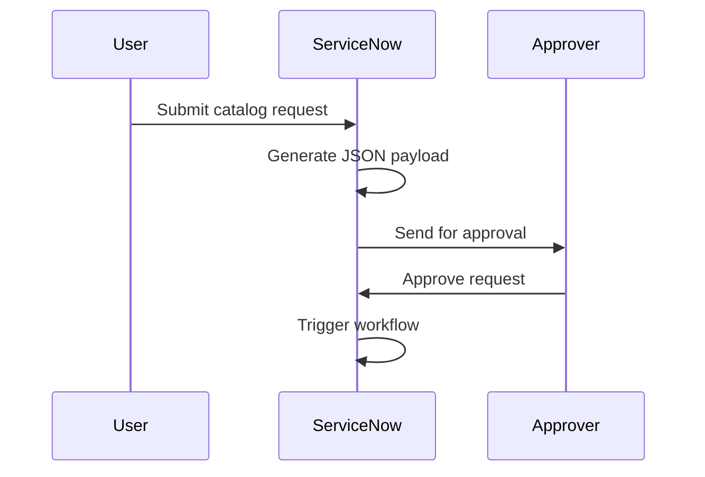
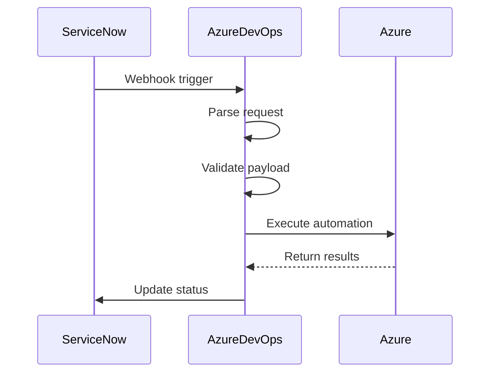
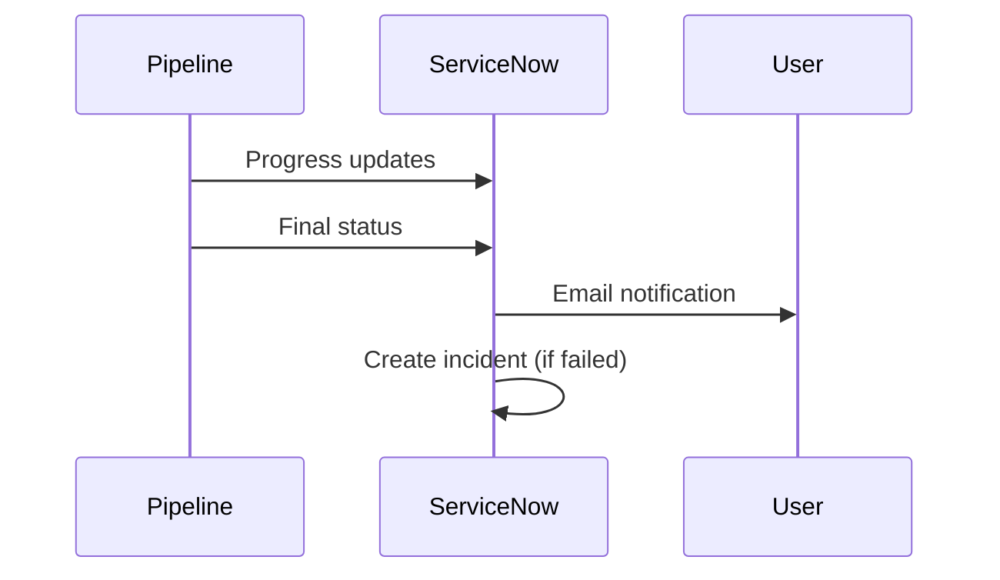

# ServiceNow to Azure AD User Creation Integration

## 🚀 Overview

This integration enables ServiceNow to automatically trigger Azure DevOps pipelines for Azure AD user account creation tasks:

- **User Account Creation** - Automated Azure AD user provisioning with role assignments
- **Service Account Management** - Create and configure service accounts with Key Vault integration
- **AVD User Setup** - Azure Virtual Desktop user configuration and workspace access
- **Group Management** - Automated group memberships and security group assignments

## 🏗️ Architecture

```
┌─────────────────┐    ┌──────────────────┐    ┌─────────────────┐
│   ServiceNow    │    │  Azure DevOps    │    │   Azure AD      │
│                 │    │                  │    │                 │
│ ┌─────────────┐ │    │ ┌──────────────┐ │    │ ┌─────────────┐ │
│ │User Account │ │    │ │   Pipeline   │ │    │ │    Users    │ │
│ │  Requests   │ │    │ │              │ │    │ │   Groups    │ │
│ └─────────────┘ │    │ └──────────────┘ │    │ └─────────────┘ │
│        │        │    │        │         │    │        │        │
│ ┌─────────────┐ │    │ ┌──────────────┐ │    │ ┌─────────────┐ │
│ │  Workflows  │ │    │ │   Scripts    │ │    │ │  PowerShell │ │
│ │             │ │────┼─│              │ │────┼─│   Modules   │ │
│ └─────────────┘ │    │ └──────────────┘ │    │ └─────────────┘ │
│        │        │    │        │         │    │        │        │
│ ┌─────────────┐ │    │ ┌──────────────┐ │    │ ┌─────────────┐ │
│ │ REST APIs   │ │    │ │   Webhooks   │ │    │ │   Key Vault │ │
│ │             │ │    │ │              │ │    │ │             │ │
│ └─────────────┘ │    │ └──────────────┘ │    │ └─────────────┘ │
└─────────────────┘    └──────────────────┘    └─────────────────┘
```

## 📦 Components

### ServiceNow Components
- **Custom Tables** - Store automation requests and track status
- **Catalog Items** - User-friendly forms for requesting Azure resources
- **Workflows** - Business logic and approval processes
- **Business Rules** - Automatic payload generation and validation
- **REST Messages** - Integration with Azure DevOps APIs

### Azure DevOps Components
- **Pipeline** - Main orchestration engine (`servicenow-automation-pipeline.yml`)
- **Scripts** - PowerShell modules for Azure automation
- **Schemas** - JSON validation for request payloads
- **Variable Groups** - Configuration and credentials management
- **Webhooks** - Trigger mechanisms from ServiceNow

### Azure Components
- **Service Principal** - Authentication for automation
- **Key Vault** - Secure credential storage
- **Resource Groups** - Organized resource management
- **PowerShell Modules** - Azure automation capabilities

## 🔄 Integration Flow

### 1. Request Initiation


### 2. Pipeline Execution


### 3. Status Updates


## 📋 Request Types

### User Account Creation Request
```json
{
  "requestType": "user_account",
  "requestId": "REQ001234",
  "requester": "manager@company.com",
  "accountType": "service_account",
  "userDetails": {
    "userPrincipalName": "svc-webapp@company.com",
    "displayName": "WebApp Service Account",
    "firstName": "WebApp",
    "lastName": "Service"
  },
  "groupMemberships": [
    {
      "groupName": "WebApp-Contributors",
      "justification": "Service account needs contributor access"
    }
  ],
  "approvals": {
    "managerApproval": true,
    "itSecurityApproval": true
  }
}
```

### VM Management Request
```json
{
  "requestType": "vm_management",
  "requestId": "REQ001236",
  "operation": "restart",
  "targetVMs": [
    {
      "vmName": "prod-web-01",
      "resourceGroup": "rg-prod-web",
      "subscription": "BAB_PROD"
    }
  ],
  "scheduling": {
    "executeImmediately": false,
    "scheduledDateTime": "2024-01-15T02:00:00Z"
  },
  "approvals": {
    "managerApproval": true,
    "itApproval": true,
    "changeControlApproval": true
  }
}
```

## 🔧 Configuration

### Azure DevOps Variables
```yaml
# Variable Group: servicenow-integration
SERVICENOW_INSTANCE: company.service-now.com
SERVICENOW_USERNAME: $(servicenow-user)
SERVICENOW_PASSWORD: $(servicenow-password)
SMTP_SERVER: smtp.company.com
FROM_EMAIL: azure-automation@company.com

# Variable Group: cloud-subs
AZURE_CLIENT_ID: $(azure-client-id)
AZURE_CLIENT_SECRET: $(azure-client-secret)
AZURE_TENANT_ID: $(azure-tenant-id)
BAB_DEV_SUBSCRIPTION_ID: $(bab-dev-subscription)
BAB_SIT_SUBSCRIPTION_ID: $(bab-sit-subscription)
BAB_PROD_SUBSCRIPTION_ID: $(bab-prod-subscription)
```

### ServiceNow Configuration
```javascript
// Custom Table: u_azure_automation_request
// Fields:
// - u_request_type (Choice): user_account
// - u_account_type (Choice): standard_user, service_account, avd_user
// - u_upn (String): User Principal Name
// - u_display_name (String): User display name
// - u_first_name (String): First name
// - u_last_name (String): Last name
// - u_department (String): Department
// - u_job_title (String): Job title
// - u_manager_email (String): Manager email
// - u_group_memberships (String Long): Group memberships
// - u_azure_roles (String Long): Azure role assignments
// - u_request_payload (String Long): JSON payload
// - u_azure_status (Choice): Pending, In Progress, Completed, Failed
// - u_automation_message (String): Status messages
// - u_pipeline_build_id (String): Azure DevOps build ID

// Business Rule: Generate User Account Payload
// Trigger: Before Insert/Update
// Condition: u_request_type == 'user_account'
```

## 🔒 Security Features

### Authentication & Authorization
- **Service Principal Authentication** - Secure Azure access
- **Role-Based Access Control** - Granular permissions
- **Approval Workflows** - Multi-level approval requirements
- **Key Vault Integration** - Secure credential storage

### Validation & Security Checks
- **JSON Schema Validation** - Request format validation
- **Business Rules Validation** - Custom business logic
- **Permission Validation** - User authorization checks
- **Network Configuration Validation** - Security compliance

### Audit & Compliance
- **Comprehensive Logging** - All actions logged
- **Audit Records** - Permanent audit trail
- **Change Control Integration** - Production change approval
- **Incident Creation** - Automatic incident for failures

## 📊 Monitoring & Alerts

### Pipeline Monitoring
- Pipeline execution status
- Task-level success/failure rates
- Performance metrics
- Resource usage tracking

### ServiceNow Integration
- Request processing times
- Approval workflow metrics
- Error rates and patterns
- User satisfaction tracking

### Alert Mechanisms
- Email notifications to requesters
- ServiceNow incident creation for failures
- Pipeline failure notifications
- Quota and limit alerts

## 🚦 Status Updates

The integration provides real-time status updates throughout the automation process:

| Status | Description |
|--------|-------------|
| **Pending** | Request submitted, awaiting processing |
| **In Progress** | Pipeline executing automation |
| **Completed** | Automation completed successfully |
| **Failed** | Automation failed with errors |
| **Partial** | Some operations succeeded, some failed |

## 📈 Benefits

### For End Users
- **Self-Service Portal** - Easy-to-use ServiceNow catalog
- **Automated Approvals** - Streamlined approval process
- **Real-Time Updates** - Progress tracking and notifications
- **Audit Trail** - Complete request history

### For IT Operations
- **Reduced Manual Work** - Automated Azure tasks
- **Standardized Processes** - Consistent automation
- **Improved Security** - Controlled access and approvals
- **Better Compliance** - Audit trails and documentation

### For Management
- **Cost Control** - Automated resource tagging and tracking
- **Resource Governance** - Standardized resource creation
- **Operational Efficiency** - Reduced manual intervention
- **Risk Reduction** - Automated validation and approval

## 🔧 Customization Options

### Adding New Request Types
1. Create new JSON schema in `Schemas/` directory
2. Add validation logic in `Validate-Request.ps1`
3. Implement automation logic in `Execute-AzureAutomation.ps1`
4. Update ServiceNow table and workflows

### Custom Business Rules
- Approval requirements
- Naming conventions
- Resource limits
- Environment-specific rules

### Integration Extensions
- Additional Azure services
- Third-party tool integration
- Custom notification methods
- Advanced reporting capabilities

## 📞 Support

For questions or issues with the ServiceNow-Azure DevOps integration:

1. **Check the logs** - Pipeline and ServiceNow logs
2. **Review the documentation** - Setup guides and troubleshooting
3. **Contact IT Operations** - azure-automation@company.com
4. **Create ServiceNow incident** - For production issues

## 📚 Documentation

- [ServiceNow Setup Guide](ServiceNow-Config/ServiceNow-Setup-Guide.md)
- [Pipeline Configuration](servicenow-automation-pipeline.yml)
- [Request Schemas](Schemas/)
- [PowerShell Scripts](Scripts/)
- [Troubleshooting Guide](Troubleshooting.md)